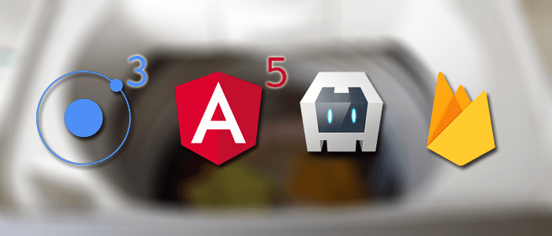

# Ionic Firebase Chat App - Ionic Tutorial Project
This application is built with this [tutorial](https://www.djamware.com/post/5a629d9880aca7059c142976/build-ionic-3-angular-5-and-firebase-simple-chat-app).



## Build Ionic 3, Angular 5 and Firebase Simple Chat App

Step by step tutorial of how to build ionic, Angular 5, Cordova and Firebase Simple Chat App

Comprehensive step by step tutorial of how to build Ionic, Angular 5, Cordova and Firebase simple chat app. The scenario for this app is filled Nickname then save to Firebase Database, choose chat rooms from ROOM list, inside chat room type and read chat messages. This time we will use Firebase module directly instead of using AngularFire.

The following tools, framework, and modules are required for this project.
 - [Ionic 3](https://ionicframework.com/)
 - [Node.js](https://nodejs.org/en/)
 - [Angular 5](https://angular.io/)
 - [Firebase NPM Module](https://www.npmjs.com/package/firebase)
 - [Firebase/Google Account](https://console.firebase.google.com/)

Start our project by cloning from GitHub.
```
git clone https://github.com/suisun2015/ionic-firebase-chatapp.git

npm install

ionic serve --lab
```

And you'll see the app running via [localhost:8100/ionic-lab](http://localhost:8100/ionic-lab) in your browser.

Happy coding from Suisun Rob!
